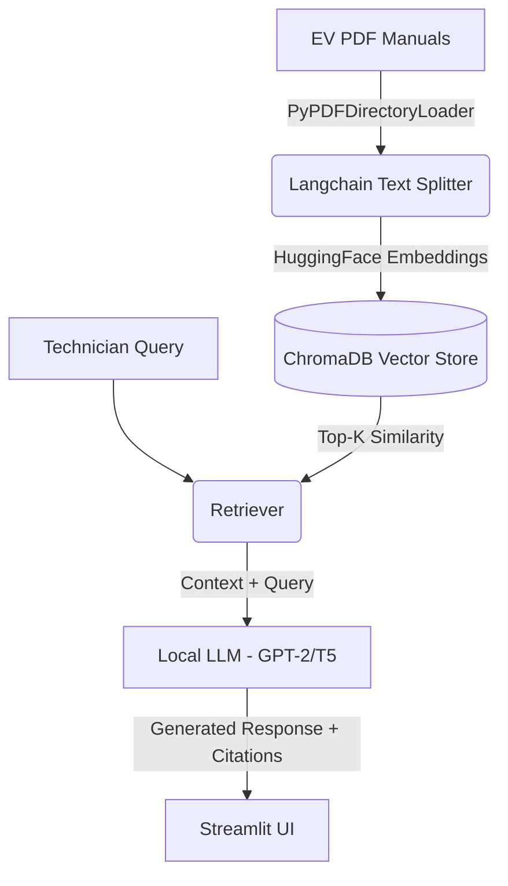

# ⚡ LLM Diagnostic Assistant for EV Technicians

This project implements a Retrieval-Augmented Generation (RAG) pipeline to embed deeply detailed EV repair manuals. It allows EV technicians to ask an AI diagnostic questions and receive exact, cited repair procedures along with source context.

## Overview

Modern Electric Vehicles have complex high-voltage systems. This application acts as an intelligent assistant tailored for EV repair shops. Instead of manually searching through thousands of pages of PDF manuals, technicians can simply query error codes or symptoms (e.g., `BMS_a066` or `Inverter resistance check`). The local LLM retrieves the most relevant sections of the manuals and generates an actionable, cited response.

### Features
* **Deep PDF Document Generation & Ingestion:** The `generate_manuals.py` script builds comprehensive, multi-page PDF guides containing complex troubleshooting trees for platforms like Tesla and Nissan. These are ingested using Langchain.
* **Local Vector Store:** Embeddings are generated locally using HuggingFace (`all-MiniLM-L6-v2`) and stored in ChromaDB.
* **Retrieval-Augmented Generation (RAG):** Uses a local LLM via HuggingFace to formulate answers strictly from the context retrieved.
* **Cited Sources:** Always cites the exact PDF file and page number so the technician can verify the repair steps. Expander widgets allow the technician to read the raw source text.
* **Modernized Streamlit UI:** A responsive, polished chat interface built with Streamlit, featuring enhanced CSS for an authentic AI chatbot feel, a side panel with architecture details, a "Clear Chat History" button, and a CSS-injected Dark/Light mode toggle.
* **Fully Tested:** Includes `pytest` tests to verify document loading, retrieval logic, and app stability.

## RAG Architecture



## Project Structure
* `generate_manuals.py` - Generates highly detailed mock PDF manuals mimicking real EV documentation (multi-page).
* `ingest.py` - Loads PDFs, splits text, creates embeddings, and saves to the Chroma vector database.
* `app.py` - Streamlit application handling the chat UI, Dark/Light modes, and the Langchain RAG chain.
* `test_app.py` - Pytest unit tests for ingestion and retrieval components.
* `data/` - Directory containing the generated PDF manuals.
* `chroma_db/` - Local directory where the embedded vectors are persisted.

## Setup Instructions

1. **Create Virtual Environment & Install Dependencies:**
   ```bash
   python3 -m venv venv
   source venv/bin/activate
   pip install -r requirements.txt
   ```

2. **Generate Deep EV Manuals:**
   This script will populate the `data/` directory with multi-page PDF files simulating comprehensive EV technical manuals.
   ```bash
   python generate_manuals.py
   ```

3. **Ingest the Data:**
   This step parses the PDFs, embeds them locally, and builds the Chroma database.
   ```bash
   python ingest.py
   ```

## Usage

Start the interactive Streamlit application:
```bash
streamlit run app.py
```
* Navigate to `http://localhost:8501`.
* Use the sidebar to toggle between Light Mode and Dark Mode, and clear the chat history.
* Enter a query into the text input, for example: `"How to check Inverter resistance for Nissan?"`.
* The AI will retrieve the relevant manual context, generate diagnostic steps, and cite the specific manual and page number!

## Testing
Run the test suite using pytest to verify document loading and vector store functionality:
```bash
pytest test_app.py -v
```
