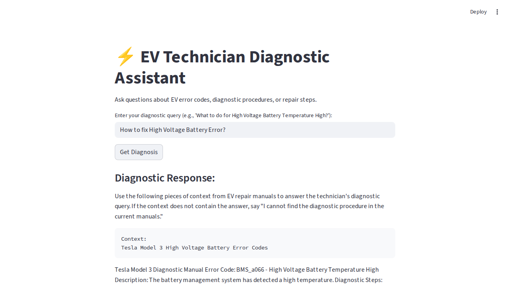

# ⚡ LLM Diagnostic Assistant for EV Technicians

This project implements a Retrieval-Augmented Generation (RAG) pipeline to embed EV repair manuals, allowing EV technicians to ask an AI diagnostic questions and receive exact, cited repair procedures.



## Overview

Modern Electric Vehicles have complex high-voltage systems and diagnostic procedures. This application acts as an intelligent assistant tailored for EV repair shops. Instead of manually searching through thousands of pages of PDF manuals, technicians can simply query error codes or symptoms. The local LLM will retrieve the most relevant sections of the manuals and generate an actionable, cited response, minimizing diagnostic time.

### Features
* **PDF Document Ingestion Pipeline:** Uses Langchain to parse, split, and ingest mock EV technical repair manuals (e.g., Tesla High Voltage Battery issues, Nissan Leaf Inverter Replacement).
* **Local Vector Store:** Embeddings are generated locally using HuggingFace (`all-MiniLM-L6-v2`) and stored in ChromaDB.
* **Retrieval-Augmented Generation (RAG):** Uses a local LLM via HuggingFace (GPT-2 based locally for testing purposes) to formulate answers strictly from the context retrieved.
* **Cited Sources:** Always cites the exact PDF file and page number so the technician can verify the repair steps.
* **Streamlit UI:** A clean, responsive web interface built with Streamlit.
* **Fully Tested:** Includes `pytest` tests to verify document loading and retrieval logic.

## Project Structure
* `generate_manuals.py` - Generates mock PDF manuals mimicking real EV documentation.
* `ingest.py` - Loads PDFs, splits text, creates embeddings, and saves to the Chroma vector database.
* `app.py` - Streamlit application that handles the user interface and houses the Langchain RAG RetrievalQA chain.
* `test_app.py` - Pytest unit tests for ingestion and retrieval components.
* `data/` - Directory containing the generated PDF manuals.
* `chroma_db/` - Local directory where the embedded vectors are persisted.

## Setup Instructions

1. **Create Virtual Environment & Install Dependencies:**
   ```bash
   python3 -m venv venv
   source venv/bin/activate
   pip install -r requirements.txt
   ```

2. **Generate Mock EV Manuals:**
   This script will populate the `data/` directory with PDF files simulating EV technical manuals.
   ```bash
   python generate_manuals.py
   ```

3. **Ingest the Data:**
   This step parses the PDFs, embeds them locally, and builds the Chroma database.
   ```bash
   python ingest.py
   ```

## Usage

Start the interactive Streamlit application:
```bash
streamlit run app.py
```
* Navigate to `http://localhost:8501`.
* Enter a query into the text input, for example: `"How to fix High Voltage Battery Error?"` or `"Nissan Leaf Inverter Failure"`.
* The AI will retrieve the relevant manual context, generate diagnostic steps, and cite the specific manual and page number!

## Testing
Run the test suite using pytest to verify document loading and vector store functionality:
```bash
pytest test_app.py -v
```
